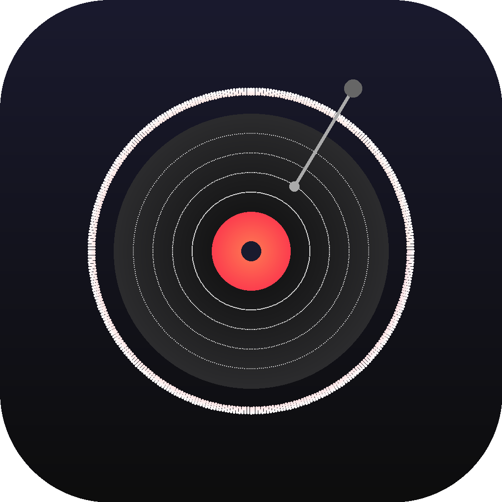
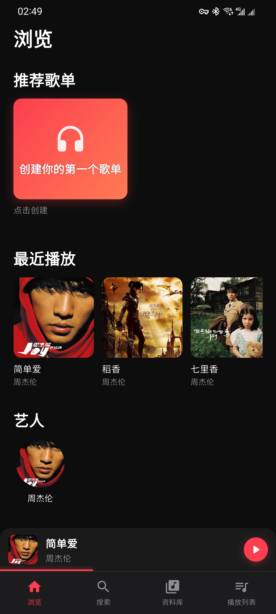
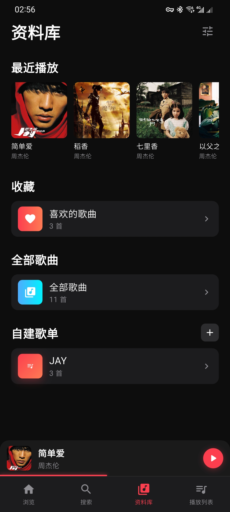
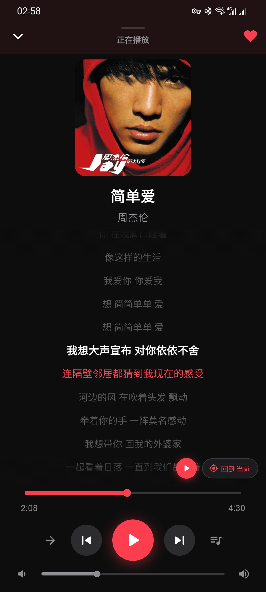
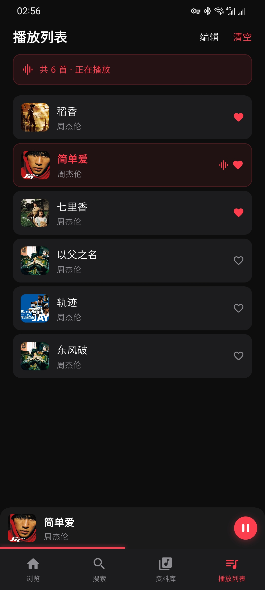
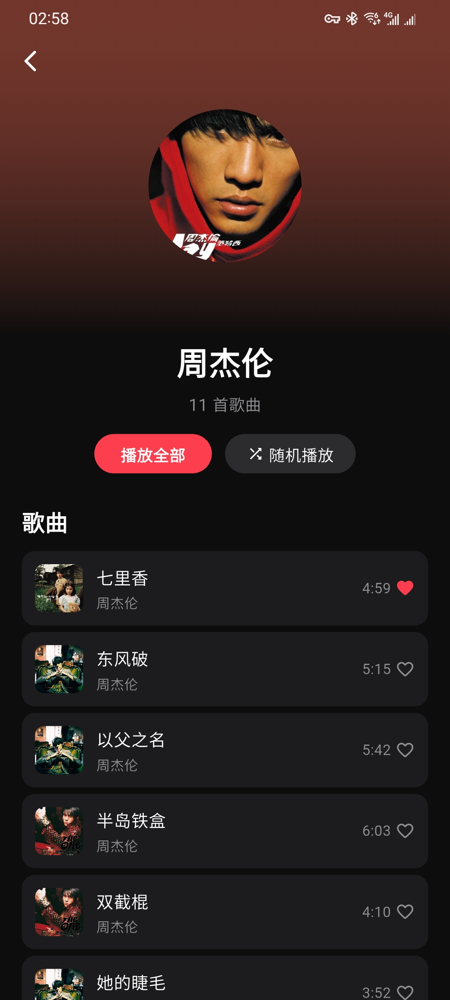
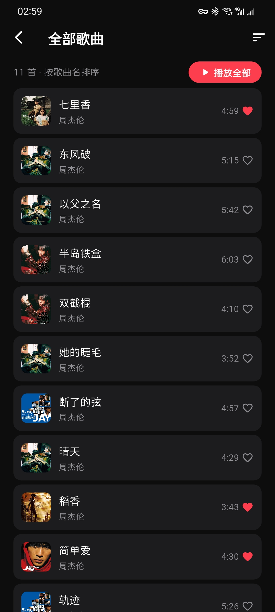
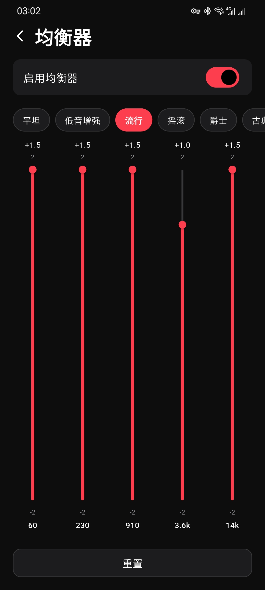

<p align="center">
  
</p>

<h1 align="center">乐听 LeTing</h1>

<p align="center">
  Apple Music 风格的本地音乐播放器，Flutter 构建<br>
  A local music player with Apple Music style dark theme UI, built with Flutter.
</p>

<p align="center">
  <a href="https://flutter.dev"></a>
  <a href="https://github.com/sealovesky/leting/releases"></a>
  <a href="LICENSE"></a>
  <a href="https://github.com/sealovesky/leting/stargazers"></a>
</p>

<p align="center">
  
  
</p>

[中文](#中文) | [English](#english)

---

## 中文

### 简介

乐听（LeTing）是一款用 Flutter 构建的跨平台本地音乐播放器。采用 Apple Music 风格深色主题 UI，播放设备上存储的音乐文件。无需联网，无需账号 — 只为你的音乐。

### 功能特性

#### 播放
- 完整播放控制和队列管理
- 播放模式：顺序、随机、单曲循环、列表循环
- 后台播放 + 通知栏控制
- 均衡器（Android）
- 播放队列跨重启持久化

#### 资料库
- 本地音乐扫描 + ID3 元数据和封面提取
- 艺人和专辑浏览（从音乐库聚合）
- 自定义艺人头像
- 收藏和播放历史
- 歌单创建和管理

#### 体验
- LRC 歌词同步显示
- 全文搜索 + 搜索历史
- 深色 / 浅色 / 跟随系统主题
- 多语言：中文和英文
- 应用名称随系统语言切换

### 截图

<p align="center">
  
  
  
  
</p>
<p align="center">
  
  
  
  
</p>

### 安装

#### 环境要求
- Flutter SDK >= 3.10
- Android: compileSdk 34, minSdk 21
- iOS: Deployment Target 13.0
- macOS: 仅 macOS 构建需要

#### 从源码构建

```bash
# 克隆仓库
git clone https://github.com/sealovesky/leting.git
cd leting

# 安装依赖
flutter pub get

# 生成本地化代码
flutter gen-l10n

# 运行（调试模式）
flutter run

# 构建发布版 APK
flutter build apk --release

# 构建 iOS
flutter build ios --release
```

#### 下载发布版

前往 [Releases](https://github.com/sealovesky/leting/releases) 页面下载预编译 APK。

### 使用方法

1. **启动** — 首次打开会提示扫描本地音乐
2. **扫描** — 授予存储权限后扫描设备中的音乐文件
3. **浏览** — 在资料库页面浏览歌曲、艺人、专辑
4. **播放** — 点击歌曲开始播放，上滑进入全屏播放器
5. **整理** — 创建歌单、收藏歌曲、设置自定义艺人头像

### 项目结构

```
lib/
├── main.dart                    # 入口，MultiProvider 注入
├── theme/
│   └── app_theme.dart           # 颜色和主题配置
├── models/
│   ├── song.dart                # 歌曲模型（对应 songs 表）
│   ├── artist.dart              # 艺人模型（内存聚合）
│   ├── album.dart               # 专辑模型（内存聚合）
│   ├── playlist.dart            # 歌单模型（对应 playlists 表）
│   └── play_mode.dart           # 播放模式枚举
├── services/
│   ├── audio_player_service.dart    # just_audio + audio_service 封装
│   ├── local_music_service.dart     # 文件扫描 + 元数据提取
│   ├── lyrics_service.dart          # LRC 歌词解析
│   ├── storage_service.dart         # SQLite 全表 CRUD
│   └── preference_service.dart      # SharedPreferences KV 存储
├── providers/
│   ├── player_provider.dart     # 播放状态、队列、进度、音量
│   ├── library_provider.dart    # 歌曲、艺人、专辑、收藏、历史
│   ├── playlist_provider.dart   # 歌单 CRUD
│   ├── search_provider.dart     # 搜索 + 历史
│   └── settings_provider.dart   # 主题、语言、音质
├── screens/                     # 所有页面级组件
└── widgets/                     # 可复用组件
```

Services 层无 Flutter 依赖。Provider 层调用 Services 并通过 `notifyListeners()` 驱动 UI。

### 技术栈

| 包名 | 用途 |
|------|------|
| provider | 状态管理 |
| just_audio | 音频播放引擎 |
| audio_service | 后台播放 + 通知栏控制 |
| audio_metadata_reader | ID3 标签和封面提取（纯 Dart） |
| permission_handler | Android/iOS 存储权限 |
| sqflite | SQLite 本地数据库 |
| shared_preferences | KV 持久化 |

### 开发计划

- [x] 本地音乐扫描和元数据提取
- [x] 完整播放控制和队列管理
- [x] 播放队列跨重启持久化
- [x] LRC 歌词显示
- [x] 收藏和播放历史
- [x] 歌单管理
- [x] 艺人和专辑浏览
- [x] 自定义艺人头像
- [x] 全文搜索 + 搜索历史
- [x] 后台播放 + 通知栏控制
- [x] 均衡器（Android）
- [x] 深色 / 浅色 / 跟随系统主题
- [x] 多语言（中文 / 英文）
- [ ] Hero 动画（迷你播放条 → 全屏播放器）
- [ ] 下滑关闭全屏播放器
- [ ] 拖拽排序播放列表
- [ ] 更多排序和筛选选项
- [ ] 锁屏控制增强
- [ ] macOS 音乐目录扫描

### 许可证

MIT License — 详见 [LICENSE](LICENSE)

---

## English

### Introduction

LeTing (乐听) is a cross-platform local music player built with Flutter. It features an Apple Music-inspired dark theme UI and plays music files stored on your device. No streaming, no accounts — just your music.

### Features

#### Playback
- Full playback controls with queue management
- Play modes: sequential, shuffle, repeat one, repeat all
- Background playback with notification bar controls
- Equalizer (Android)
- Play queue persistence across app restarts

#### Library
- Local music scanning with ID3 metadata & cover art extraction
- Artist & album browsing (aggregated from library)
- Custom artist avatars
- Favorites & play history
- Playlist creation and management

#### Experience
- LRC lyrics display (synced with playback)
- Full-text search with history
- Dark / Light / System theme
- i18n: Chinese & English
- Localized app name per system language

### Screenshots

<p align="center">
  
  
  
  
</p>
<p align="center">
  
  
  
  
</p>

### Installation

#### Requirements
- Flutter SDK >= 3.10
- Android: compileSdk 34, minSdk 21
- iOS: Deployment Target 13.0
- macOS: for macOS build only

#### From Source

```bash
# Clone the repository
git clone https://github.com/sealovesky/leting.git
cd leting

# Install dependencies
flutter pub get

# Generate l10n
flutter gen-l10n

# Run (debug)
flutter run

# Build release APK
flutter build apk --release

# Build iOS
flutter build ios --release
```

#### Download Release

Check the [Releases](https://github.com/sealovesky/leting/releases) page for pre-built APKs.

### Usage

1. **Launch** — Open the app, you'll be prompted to scan local music on first launch
2. **Scan** — Grant storage permission and scan your device for music files
3. **Browse** — Navigate through songs, artists, albums from the library tab
4. **Play** — Tap any song to start playback, swipe up for full-screen player
5. **Organize** — Create playlists, mark favorites, set custom artist avatars

### Project Structure

```
lib/
├── main.dart                    # Entry point, MultiProvider injection
├── theme/
│   └── app_theme.dart           # Colors & theme config
├── models/
│   ├── song.dart                # Song model (maps to songs table)
│   ├── artist.dart              # Artist model (in-memory aggregation)
│   ├── album.dart               # Album model (in-memory aggregation)
│   ├── playlist.dart            # Playlist model (maps to playlists table)
│   └── play_mode.dart           # Play mode enum
├── services/
│   ├── audio_player_service.dart    # just_audio + audio_service wrapper
│   ├── local_music_service.dart     # File scanning + metadata extraction
│   ├── lyrics_service.dart          # LRC lyrics parsing
│   ├── storage_service.dart         # SQLite CRUD for all tables
│   └── preference_service.dart      # SharedPreferences KV store
├── providers/
│   ├── player_provider.dart     # Playback state, queue, progress, volume
│   ├── library_provider.dart    # Songs, artists, albums, favorites, history
│   ├── playlist_provider.dart   # Playlist CRUD
│   ├── search_provider.dart     # Search + history
│   └── settings_provider.dart   # Theme, language, audio quality
├── screens/                     # All page-level widgets
└── widgets/                     # Reusable components
```

Services layer has no Flutter dependency. Providers call services and drive UI via `notifyListeners()`.

### Tech Stack

| Package | Purpose |
|---------|---------|
| provider | State management |
| just_audio | Audio playback engine |
| audio_service | Background playback + notification controls |
| audio_metadata_reader | ID3 tag & cover art extraction (pure Dart) |
| permission_handler | Android/iOS storage permissions |
| sqflite | SQLite local database |
| shared_preferences | KV persistence |

### Android Permissions

- `READ_EXTERNAL_STORAGE` / `READ_MEDIA_AUDIO` — local music scanning
- `FOREGROUND_SERVICE` / `WAKE_LOCK` — background playback

### Roadmap

- [x] Local music scanning & metadata extraction
- [x] Full playback controls & queue management
- [x] Play queue persistence across restarts
- [x] LRC lyrics display
- [x] Favorites & play history
- [x] Playlist management
- [x] Artist & album browsing
- [x] Custom artist avatars
- [x] Full-text search with history
- [x] Background playback with notification controls
- [x] Equalizer (Android)
- [x] Dark / Light / System theme
- [x] i18n (Chinese & English)
- [ ] Hero animation (mini player → full-screen player)
- [ ] Swipe-to-dismiss full-screen player
- [ ] Drag-to-reorder playlist
- [ ] More sorting & filtering options
- [ ] Widget / lock screen controls enhancement
- [ ] macOS music directory scanning

### License

MIT License — see [LICENSE](LICENSE) for details.

---

## Contributing

Contributions are welcome! Please feel free to submit a Pull Request.

1. Fork the repository
2. Create your feature branch (`git checkout -b feature/amazing-feature`)
3. Commit your changes (`git commit -m 'Add some amazing feature'`)
4. Push to the branch (`git push origin feature/amazing-feature`)
5. Open a Pull Request

## Acknowledgments

- UI inspired by Apple Music
- Built with [Flutter](https://flutter.dev) and [just_audio](https://pub.dev/packages/just_audio)
- Metadata extraction powered by [audio_metadata_reader](https://pub.dev/packages/audio_metadata_reader)
